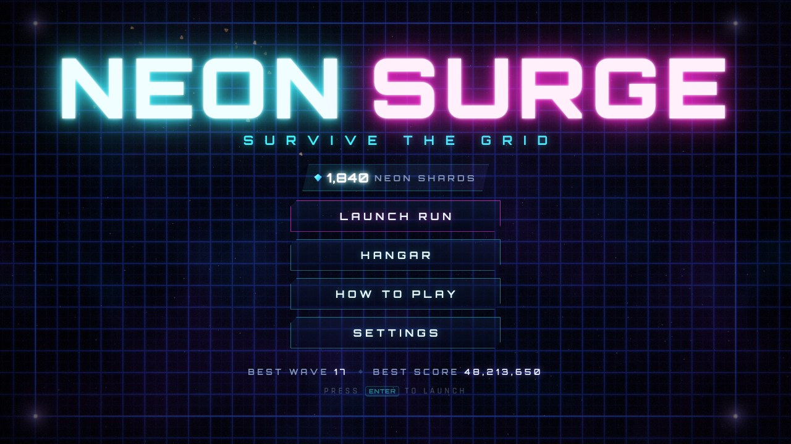
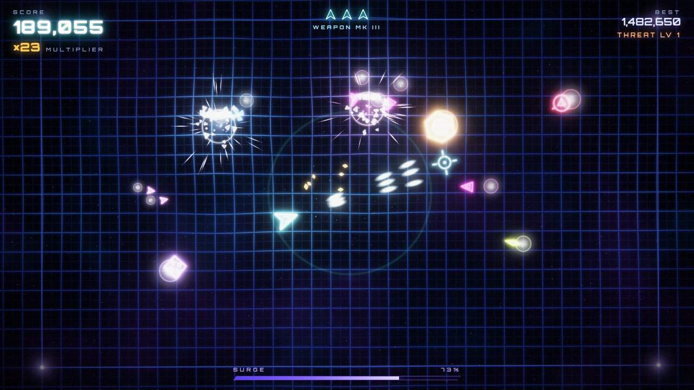
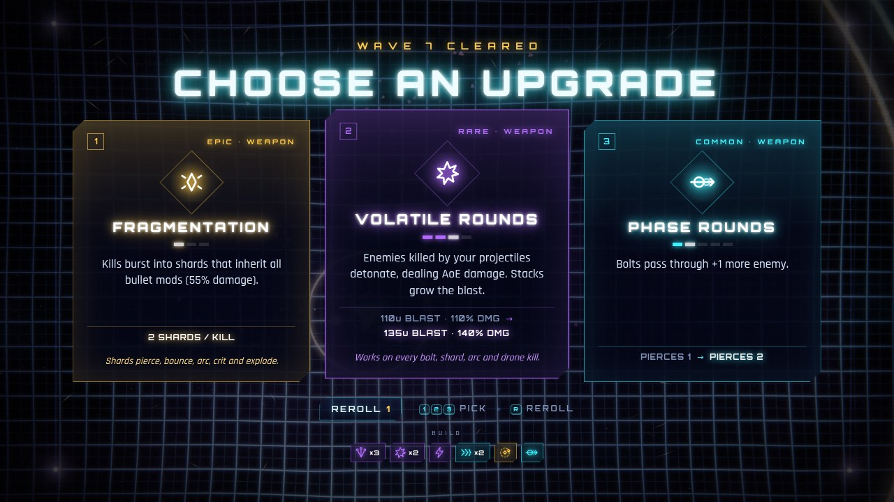
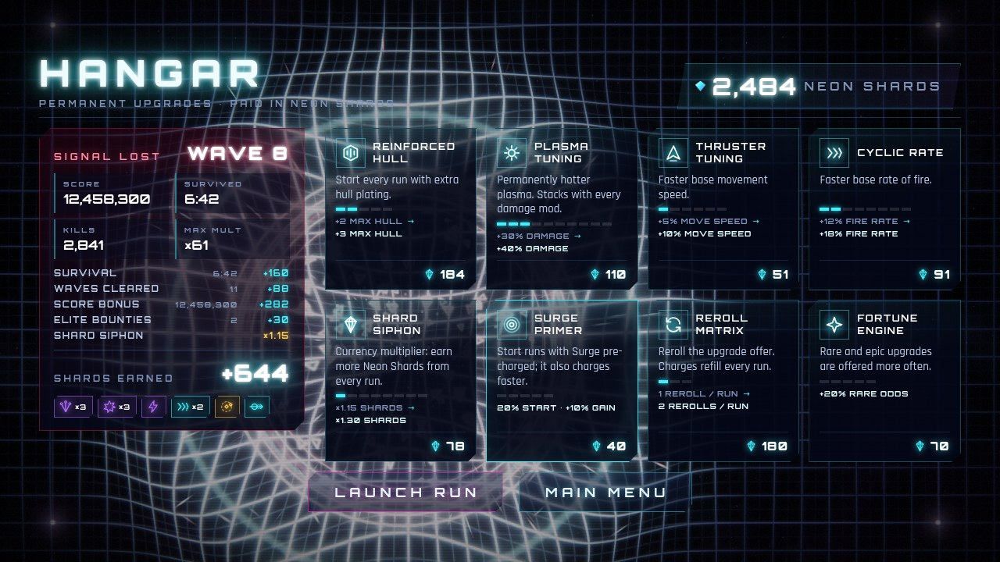

# NEON SURGE

A fast-paced twin-stick **roguelite** shooter. You pilot a glowing ship on a warping neon
grid while swarms of geometric enemies close in from every edge. Survive timed waves, pick
one of three stackable upgrades after each one, and when your hull finally breaks, spend
the run's **Neon Shards** in the Hangar on permanent upgrades. It runs in the browser
(itch.io HTML5) and ships as a native Windows `.exe` through Electron.






**Stack:** HTML5, modular ES6 JavaScript, **PixiJS 8.21** (WebGL 2) loaded from the jsDelivr
CDN with a bundled offline fallback, custom GLSL post-processing, and the Web Audio API.
There are no image or sound files: every sprite is painted procedurally and every sound
is synthesized at runtime. All text (HUD, menus, upgrade cards, shop, combat numbers) is
crisp HTML in a DOM layer over the canvas; the WebGL canvas never draws text.

---

## Folder structure

```
NEON-SURGE/
├── index.html                 Web entry point + the #ui-layer DOM (HUD, all screens)
├── css/
│   └── style.css              UI layer: HUD, menus, upgrade cards, Hangar, combat text
├── src/
│   ├── boot.js                Boot sequence, wiring, main loop
│   ├── preflight.js           Classic script: shows boot errors on screen (file:// hint etc.)
│   ├── config.js              Every tuning value: base stats, enemies, rounds, quality
│   ├── lib/
│   │   └── pixi.js            Loads PixiJS from jsDelivr, falls back to /vendor (offline/desktop)
│   ├── core/
│   │   ├── Input.js           Keyboard (physical keys), mouse, gamepad
│   │   └── math.js            Easing, colour, smooth noise for camera shake
│   ├── render/
│   │   ├── Pipeline.js        HDR scene target, 13-tap bloom mip chain, final composite
│   │   ├── shaders.js         All GLSL ES 3.00 programs
│   │   ├── WarpGrid.js        Spring-mass lattice (physics + GPU mesh + dynamic lights)
│   │   ├── GlowLayer.js       HDR additive sprite batch (ParticleContainer + custom shader)
│   │   ├── Atlas.js           Procedural sprite atlas (shapes, glows, sparks; no text)
│   │   ├── Backdrop.js        Nebula + parallax starfield
│   │   └── Trail.js           Engine plasma ribbon
│   ├── fx/
│   │   ├── Effects.js         "Juice" API: explosions, blasts, arcs, crits, novas, death
│   │   ├── Particles.js       Struct-of-arrays particle sim (bounce, stretch, spin, flicker)
│   │   ├── Camera.js          Trauma shake, directional kick, zoom punch, world->screen
│   │   ├── Lights.js          Short-lived point lights that illuminate the grid
│   │   ├── Shockwaves.js      Screen-space refraction rings
│   │   └── Arcs.js            Crackling lightning arcs (Arc Coil upgrade)
│   ├── game/
│   │   ├── Game.js            State machine (waves/upgrade/hangar), damage pipeline, rendering
│   │   ├── Upgrades.js        20 stackable upgrades, stat builder, shot profile, offer roller
│   │   ├── Meta.js            Neon Shards, Hangar shop, rewards, validated localStorage save
│   │   ├── Director.js        Timed rounds: spawn budget, set pieces, elites
│   │   ├── Player.js          Ship movement, aiming, multishot volleys
│   │   ├── Bullets.js         Bolts (bounce, pierce, homing, swept collision) + enemy orbs
│   │   ├── Enemies.js         Six archetypes + elite variants: behaviours + visuals
│   │   ├── Drones.js          Guardian Drone satellites
│   │   ├── Flux.js            Multiplier pickups
│   │   └── SpatialHash.js     Collision broadphase
│   ├── audio/
│   │   ├── AudioEngine.js     Synth SFX, reverb, compressor, muffle filter
│   │   └── Music.js           Generative synthwave sequencer (adaptive layers)
│   └── ui/
│       ├── UI.js              DOM layer: screens, HUD, upgrade cards, Hangar, gamepad menus
│       ├── FloatText.js       Pooled DOM combat numbers that follow the camera and its shake
│       ├── icons.js           Inline SVG icons for upgrades, chips and the shop
│       └── settings.js        Persistent settings (localStorage)
├── vendor/
│   ├── pixi.min.js            PixiJS 8.21.0 ESM build (same bytes the CDN serves as .mjs)
│   └── PIXI-LICENSE.txt
├── assets/
│   ├── icon.svg, icon.png     Favicon / window icon
│   └── fonts/                 Orbitron + Rajdhani (woff2) with their OFL licences
├── electron/
│   ├── main.js                Electron main process (frameless window, app:// protocol)
│   └── preload.js             Context-isolated bridge: fullscreen / minimize / quit
├── build/
│   ├── icon.ico               Windows icon (16–256 px) for the .exe and installer
│   └── icon.png
├── tools/
│   ├── serve.mjs              Zero-dependency local web server
│   └── build-web.mjs          Packs dist/neon-surge-web.zip for itch.io
├── docs/                      README screenshots
└── package.json               npm scripts + electron-builder configuration
```

---

## Play it locally (web)

ES modules don't load from `file://`, so serve the folder over HTTP. Any static server works:

```bash
npm run serve                  # zero-dependency server -> http://localhost:8080
# or
python -m http.server 8080     # then open http://localhost:8080
# or
npx serve .
```

URL flags: `?offline` forces the bundled PixiJS copy, `?debug` exposes `window.NEON`,
and `?god` makes you invulnerable (for testing).

## Publish on itch.io

```bash
npm run build:web              # -> dist/neon-surge-web.zip  (index.html at the zip root)
```

1. On itch.io choose **Create new project**, set **Kind of project** to **HTML**, and upload
   `dist/neon-surge-web.zip`. Tick **This file will be played in the browser**.
2. Embed options: viewport **1280 × 720**, enable **Fullscreen button**, leave
   **Mobile friendly** off (the game needs a keyboard and mouse, or a gamepad).
3. Optional: upload the Windows build below on the same page, tagged as Windows.

> Zipping by hand? Make sure `index.html` sits at the zip root. Avoid Windows PowerShell 5's
> `Compress-Archive`: it writes backslash paths that break sub-folders on itch.io.
> `build-web.mjs` always writes correct forward-slash paths.

---

## Build the Windows `.exe`

Requirements: Windows 10/11 x64 and **Node.js 22.12 or newer** (the current LTS release is
fine). npm comes with Node.js.

### Installing Node.js and npm (Windows)

```powershell
winget install -e --id OpenJS.NodeJS.LTS
```

If `winget` isn't available, download the **LTS** installer from https://nodejs.org and run it
with the default options.

Then **close the terminal and open a new one**, so it picks up the new PATH, and check:

```powershell
node -v    # must print v22.12.0 or higher
npm -v
```

Troubleshooting:

- `'npm' is not recognized...`: Node.js isn't installed, or the terminal was opened before the
  install finished. Open a new terminal (or sign out and back in).
- `npm.ps1 cannot be loaded because running scripts is disabled on this system` (PowerShell):
  run `Set-ExecutionPolicy -Scope CurrentUser -ExecutionPolicy RemoteSigned` once and answer `Y`.
  Alternatively, use **Command Prompt** (`cmd`) instead of PowerShell.
- `node -v` shows an older version: run `winget upgrade -e --id OpenJS.NodeJS.LTS`, or install the
  current LTS from nodejs.org.

### Building

Run these in PowerShell or cmd, in the project folder:

```powershell
npm install                    # installs Electron + electron-builder (downloads ~150 MB)
npm start                      # run the desktop build straight away (starts fullscreen)
npm run build:win              # build the installer + the portable exe
```

Output in `dist\`:

| File | What it is |
| --- | --- |
| `NeonSurge-Setup-1.0.0.exe` | Installer (Start-menu + desktop shortcuts, custom install dir) |
| `NeonSurge-1.0.0-Portable.exe` | Single-file portable build, no install needed |
| `win-unpacked\Neon Surge.exe` | Unpacked app folder (zip it for a "no installer" download) |

To build only one of them, run `npm run build:win:installer` or `npm run build:win:portable`.

Notes:

- The executables are **unsigned**, so Windows SmartScreen may warn on first launch
  (**More info → Run anyway**). To sign, set `CSC_LINK` and `CSC_KEY_PASSWORD` before building
  (see the electron-builder code-signing docs).
- Building on **macOS or Linux**: the NSIS installer and portable targets need `wine`.
  Without wine you can still produce the unpacked app:
  `npx electron-builder --win dir --x64 -c.win.signAndEditExecutable=false`
  (the exe keeps the default Electron icon in that case).
- Desktop controls: **F11** or **Alt+Enter** toggles fullscreen/windowed. The window is
  frameless; in windowed mode a slim title bar (drag, fullscreen, minimize, quit) appears
  on menus. Run `npm run start:windowed` to start windowed. The window state is remembered.

### How the desktop build works

- `electron/main.js` serves the game from a private, secure `app://neon-surge/` origin rather
  than `file://`, so ES modules, `fetch` and `localStorage` behave exactly as on a web
  server. It also attaches a strict Content-Security-Policy.
- Context isolation, sandboxing and `nodeIntegration: false` are all on. The page only sees
  the four functions exposed in `electron/preload.js`, and IPC calls are origin-checked.
- The desktop build loads PixiJS from `vendor/` first, so it works fully offline.
- `ignore-gpu-blocklist` keeps WebGL available on older GPUs, and autoplay is allowed so the
  soundtrack starts on the title screen.

---

## Controls

| Action | Keyboard / mouse | Gamepad |
| --- | --- | --- |
| Move | `W A S D` / arrow keys | Left stick |
| Aim | Mouse | Right stick |
| Fire | Left click (hold) | Right stick / RT |
| Surge (screen-clearing nova) | `Space` / right click | LB / A |
| Pick an upgrade | Click a card / `1` `2` `3` | D-pad + A |
| Reroll the offer | `R` / the Reroll button | Y |
| Pause | `Esc` / `P` | Start |
| Mute / Fullscreen | `M` / `F` (`F11` on desktop) | — |

---

## How a run works

1. **Timed waves.** Each wave lasts 25 s, growing by 2 s per wave up to 45 s. Survive until
   the timer runs out: a golden purge nova clears the arena and vacuums up your flux. Every
   5th wave spawns a crowned **elite** (an armoured heavy with a health bar); that wave
   doesn't end until every elite is dead. Difficulty depends only on the wave number (spawn
   budget, population cap, enemy speed and HP). There is no more score-driven scaling.
2. **Pick 1 of 3 upgrades.** The game freezes and offers three random cards weighted by
   rarity (common / rare / epic). Cards that combine with what you already own show up
   more often, and at least one weapon card is always offered. The card shows the stat
   change (`1 BOUNCE → 2 BOUNCES`), level pips and the synergy it enables.
3. **Die, bank, upgrade.** When your hull breaks (or you abandon the run from the pause
   menu), the run pays out **Neon Shards** and you land in the **Hangar**: a run summary
   with an itemised reward breakdown next to the permanent upgrade shop.

**Shards per run** = survival seconds × 0.4 + waves cleared × 8 + √score × 0.08 + 15 per
elite (+ Shard Caches), all multiplied by the Shard Siphon multiplier. The HUD shows the
running total (`◆ +126`).

### Stackable upgrades (in-run)

Every upgrade is a pure modifier on a stats table that is **rebuilt from scratch** (base
stats → Hangar levels → upgrade stacks, in a fixed order) whenever your build changes. All
bullet behaviour is then baked into one shared **shot profile** that every projectile you
own references: main-gun bolts, multishot extras, drone bolts and shrapnel. That's what makes
the stacking real. With **Split Barrel + Volatile Rounds**, every extra bolt explodes. With
**Fragmentation**, the shards pierce, bounce, arc, crit and explode as well. With **Chain
Reaction**, kills from those blasts detonate again.

| Upgrade | Rarity | Max | Effect per stack |
| --- | --- | --- | --- |
| Split Barrel | rare | 6 | +1 bolt per volley (fan) |
| Overclock | common | 8 | +20% fire rate |
| Plasma Core | common | 8 | +25% damage |
| Volatile Rounds | rare | 4 | projectile kills explode (AoE); stacks grow radius + damage |
| Ricochet | common | 4 | +1 wall bounce, +30% range |
| Phase Rounds | common | 5 | pierce +1 enemy |
| Rail Accelerator | common | 4 | +25% bolt speed, +20% range, +10% damage |
| Heavy Caliber | common | 3 | +35% bolt size, +25% damage, −6% fire rate |
| Arc Coil | rare | 4 | hits arc to +1 nearby enemy for 50% damage |
| Overcharge | common | 5 | +10% crit chance, +25% crit damage |
| Seeker Guidance | rare | 3 | bolts home in on enemies |
| Fragmentation | epic | 3 | kills burst into shards that inherit every mod |
| Chain Reaction | epic | 1 | blast kills detonate too (needs Volatile Rounds) |
| Guardian Drone | epic | 3 | +1 orbiting drone firing your bolts (60% damage) |
| Hull Plating | common | 5 | +1 max hull, repair 1 |
| Nanite Swarm | rare | 2 | repair +1 hull after every wave |
| Deflector | rare | 2 | +1 shield charge per wave (absorbs a hit) |
| Afterburners | common | 4 | +12% move speed |
| Flux Magnet | common | 3 | +60% pickup range, +25% flux drops |
| Surge Capacitor | common | 4 | Surge charges 35% faster |

### Hangar (permanent upgrades)

| Upgrade | Levels | Effect per level | First cost |
| --- | --- | --- | --- |
| Reinforced Hull | 5 | +1 base max hull | 60 |
| Plasma Tuning | 10 | +10% base damage | 40 |
| Thruster Tuning | 6 | +5% base move speed | 35 |
| Cyclic Rate | 8 | +6% base fire rate | 45 |
| Shard Siphon | 8 | +15% Neon Shards (currency multiplier) | 50 |
| Surge Primer | 5 | start with +20% Surge, +10% Surge gain | 40 |
| Reroll Matrix | 3 | +1 upgrade reroll per run | 90 |
| Fortune Engine | 5 | rare and epic cards appear more often | 70 |

Costs grow geometrically per level (`src/game/Meta.js`, `SHOP`).

### Save data

Progress lives in `localStorage` under `neon-surge.meta.v1` (settings are stored separately
under `neon-surge.settings.v1`). The save code (`Meta.js`) is defensive:

- **Availability probe:** if storage is missing or blocked (sandboxed iframe, privacy mode),
  the game keeps progress in memory for the session and the Hangar shows a warning.
- **Validation:** saves are versioned JSON. Every field is rebuilt from a whitelist:
  non-numbers, negatives, NaN and Infinity become 0, levels are clamped to their max, and
  unknown keys are dropped.
- **Corruption:** unparseable data is backed up to `neon-surge.meta.v1.corrupt` before a
  fresh save is written, so nothing is destroyed silently.
- **Write failures** (quota exceeded): the purchase still applies for this session and the
  player is told it couldn't be saved.
- **Multiple tabs:** every mutation re-reads storage first, and `storage` events from other
  tabs are adopted live, so a stale tab never overwrites newer progress.
- Rewards are banked exactly once per run, in a single write. The old high score is migrated
  from `neon-surge.best.v1` on first launch. **Settings → Reset progress** wipes everything
  (after a confirmation).

**Enemies:** *Dart* (fast chaser), *Wisp* (weaves and dodges your shots), *Lancer*
(telegraphed lock-on dash), *Bulwark* (slow armoured tank), *Hive* (splits into *Mites*),
*Sentry* (keeps its distance and fires orbs you can shoot down). New archetypes unlock
wave by wave (Wisp 2, Lancer 3, Bulwark 4, Hive 5, Sentry 6). From wave 2 the director
stages telegraphed set pieces (swarm, pincer, lancer strike, siege line, crossfire).

---

## Technical art notes

**Frame pipeline** (`src/render/Pipeline.js`):

```
backdrop (nebula + parallax stars)
  + warp grid  (spring-mass lattice, analytic AA lines, 16 dynamic point lights)
  + plasma trail ribbon
  + HDR sprite batch (enemies, bolts, arcs, particles; additive; intensity up to 8x)
        │  rendered into an RGBA16F scene target (falls back to RGBA8 if unsupported)
        ▼
bloom: Karis-weighted soft-knee prefilter → 13-tap downsample ×6 → tent upsample (additive)
        ▼
composite: shockwave refraction · radial chromatic aberration · bloom · flash ·
           filmic tonemap with highlight desaturation · vignette · danger pulse ·
           scanlines · dithered grain  → canvas

#ui-layer (HTML/CSS, z-index above the canvas): HUD · announcements · combat numbers ·
           main menu · upgrade cards · Hangar/shop · settings · pause
```

**UI layer:** `#ui-layer` is a fixed, full-screen DOM overlay with `pointer-events: none`,
so aiming and firing fall through to the canvas. Only the active screen takes input.
Screens are flexbox layouts. Combat numbers are pooled DOM elements positioned each frame
by projecting their world position through the camera, shake included, so they stay razor
sharp at any resolution and still rattle with the world.

How the brief's requirements map to the code:

- **Bloom:** a true HDR chain. Bright cores exceed 1.0, so they burn white and bleed colour
  (`shaders.js`: `PREFILTER_FRAG`, `DOWNSAMPLE_FRAG`, `UPSAMPLE_FRAG`, `COMPOSITE_FRAG`).
- **Warping grid:** a Geometry-Wars-style tension-spring lattice. The ship presses a gravity
  well into it and leaves a bow wake, bolts drag it, and explosions buckle it in 3D
  (`WarpGrid.js`).
- **Particles:** enemy deaths throw spinning shards, velocity-stretched sparks, flickering
  embers and debris. All of them bounce off the arena walls and fade, while a matching point
  light lights up the grid (`Effects.explosion`). A short-lived "flash budget" shares the
  bloom between explosions that go off together, so a chain reaction of 30 kills stays
  readable instead of turning into a white-out. The sparks and shards stay at full count.
- **Engine trail:** a tapered HDR ribbon plus exhaust particles that respond to thrust.
- **Screen shake:** trauma² model driven by smooth noise. Small on each shot (plus recoil
  kick), medium on kills, violent on death; a zoom punch adds weight (`Camera.js`).
- **Hit-stop:** 30–70 ms freezes on heavy kills, multi-kills, elite kills, wave clears,
  shield blocks, player damage, surge and death, followed by slow-motion ramps
  (`Game.hitStop`, `Game.slowMo`). Routine kill freezes have a short cooldown so explosive
  builds don't stutter; the big moments always land.
- **Generative audio:** pew-pews, deep distorted bass crunches, pentatonic pickup chimes,
  alarms, and a 124 BPM synthwave track. Its kick drum pumps the mix (sidechain) and its
  layers intensify with the threat level (`AudioEngine.js`, `Music.js`).

**Performance:** the world draws in about five draw calls, plus ten bloom passes. In a
stress test with a maxed build (7-bolt volleys at 22/s, explosive + cascade + shrapnel +
arcs + 3 drones) against 160 enemies, with about 900 bolts and 10,000 sprites on screen,
the game logic took about 1.2 ms and scene building about 1.2 ms of CPU per frame. **Auto** graphics quality lowers render scale, bloom
mips and particle density if the frame rate drops. Accessibility options: *Reduce flashing*,
a screen-shake slider, and `prefers-reduced-motion` support.

**Tuning:** every gameplay and feel number lives in `src/config.js`.

---

## Third-party

- [PixiJS](https://pixijs.com) 8.21.0, MIT (`vendor/PIXI-LICENSE.txt`)
- [Orbitron](https://github.com/theleagueof/orbitron) and [Rajdhani](https://fonts.google.com/specimen/Rajdhani), SIL Open Font License 1.1 (`assets/fonts/`)
- [Electron](https://www.electronjs.org) and [electron-builder](https://www.electron.build), MIT (build tools)
