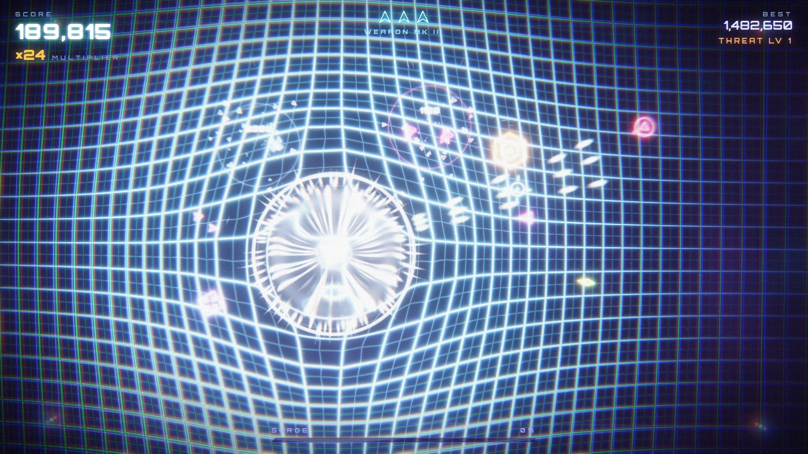

# NEON SURGE

A fast-paced twin-stick survival shooter. You pilot a glowing ship on a warping
neon grid while swarms of geometric enemies close in from every edge. It runs in the
browser (itch.io HTML5) and ships as a native Windows `.exe` through Electron.




**Stack:** HTML5, modular ES6 JavaScript, **PixiJS 8.21** (WebGL 2) loaded from the jsDelivr
CDN with a bundled offline fallback, custom GLSL post-processing, and the Web Audio API.
There are no image or sound files: every sprite is painted procedurally and every sound
is synthesized at runtime.

---

## Folder structure

```
NEON-SURGE/
├── index.html                 Web entry point (the root of the itch.io zip)
├── css/
│   └── style.css              HUD, menus, overlays, desktop title bar
├── src/
│   ├── boot.js                Boot sequence, wiring, main loop
│   ├── preflight.js           Classic script: shows boot errors on screen (file:// hint etc.)
│   ├── config.js              Every tuning value: arena, weapons, enemies, director, quality
│   ├── lib/
│   │   └── pixi.js            Loads PixiJS from jsDelivr, falls back to /vendor (offline/desktop)
│   ├── core/
│   │   ├── Input.js           Keyboard (physical keys), mouse, gamepad
│   │   └── math.js            Easing, colour, smooth noise for camera shake
│   ├── render/
│   │   ├── Pipeline.js        HDR scene target, 13-tap bloom mip chain, final composite
│   │   ├── shaders.js         All GLSL ES 3.00 programs
│   │   ├── WarpGrid.js        Spring-mass lattice (physics + GPU mesh + dynamic lights)
│   │   ├── GlowLayer.js       HDR additive sprite batch (ParticleContainer + custom shader)
│   │   ├── Atlas.js           Procedural sprite atlas (shapes, glows, sparks, glyphs)
│   │   ├── Backdrop.js        Nebula + parallax starfield
│   │   └── Trail.js           Engine plasma ribbon
│   ├── fx/
│   │   ├── Effects.js         "Juice" API: explosions, impacts, surge nova, player death
│   │   ├── Particles.js       Struct-of-arrays particle sim (bounce, stretch, spin, flicker)
│   │   ├── Camera.js          Trauma shake, directional kick, zoom punch
│   │   ├── Lights.js          Short-lived point lights that illuminate the grid
│   │   ├── Shockwaves.js      Screen-space refraction rings
│   │   └── Popups.js          Floating score numbers
│   ├── game/
│   │   ├── Game.js            State machine, combat, scoring, hit-stop, slow-mo, rendering
│   │   ├── Player.js          Ship movement, aiming, weapon patterns
│   │   ├── Bullets.js         Plasma bolts (swept collision) + enemy orbs
│   │   ├── Enemies.js         Six enemy archetypes: behaviours + visuals
│   │   ├── Director.js        Spawning, threat scaling, set-piece waves
│   │   ├── Flux.js            Multiplier pickups
│   │   └── SpatialHash.js     Collision broadphase
│   ├── audio/
│   │   ├── AudioEngine.js     Synth SFX, reverb, compressor, muffle filter
│   │   └── Music.js           Generative synthwave sequencer (adaptive layers)
│   └── ui/
│       ├── UI.js              Screens, HUD, announcements, settings, gamepad menus
│       └── settings.js        Persistent settings (localStorage)
├── vendor/
│   ├── pixi.min.mjs           PixiJS 8.21.0 ESM build (same file the CDN serves)
│   └── PIXI-LICENSE.txt
├── assets/
│   ├── icon.svg, icon.png     Favicon / window icon
│   └── fonts/                 Orbitron + Rajdhani (woff2) with their OFL licences
├── electron/
│   ├── main.js                Electron main process (frameless window, app:// protocol)
│   └── preload.js             Context-isolated bridge: fullscreen / minimize / quit
├── build/
│   ├── icon.ico               Windows icon (16–256 px) for the .exe and installer
│   └── icon.png
├── tools/
│   ├── serve.mjs              Zero-dependency local web server
│   └── build-web.mjs          Packs dist/neon-surge-web.zip for itch.io
├── docs/                      README screenshots
└── package.json               npm scripts + electron-builder configuration
```

---

## Play it locally (web)

ES modules don't load from `file://`, so serve the folder over HTTP. Any static server works:

```bash
npm run serve                  # zero-dependency server -> http://localhost:8080
# or
python -m http.server 8080     # then open http://localhost:8080
# or
npx serve .
```

URL flags: `?offline` forces the bundled PixiJS copy, `?debug` exposes `window.NEON`,
and `?god` makes you invulnerable (for testing).

## Publish on itch.io

```bash
npm run build:web              # -> dist/neon-surge-web.zip  (index.html at the zip root)
```

1. On itch.io choose **Create new project**, set **Kind of project** to **HTML**, and upload
   `dist/neon-surge-web.zip`. Tick **This file will be played in the browser**.
2. Embed options: viewport **1280 × 720**, enable **Fullscreen button**, leave
   **Mobile friendly** off (the game needs a keyboard and mouse, or a gamepad).
3. Optional: upload the Windows build below on the same page, tagged as Windows.

> Zipping by hand? Make sure `index.html` sits at the zip root. Avoid Windows PowerShell 5's
> `Compress-Archive`: it writes backslash paths that break sub-folders on itch.io.
> `build-web.mjs` always writes correct forward-slash paths.

---

## Build the Windows `.exe`

Requirements: Windows 10/11 x64 and **Node.js 20 LTS or newer** (https://nodejs.org).

Run these in PowerShell or cmd, in the project folder:

```powershell
npm install                    # installs Electron + electron-builder (downloads ~150 MB)
npm start                      # run the desktop build straight away (starts fullscreen)
npm run build:win              # build the installer + the portable exe
```

Output in `dist\`:

| File | What it is |
| --- | --- |
| `NeonSurge-Setup-1.0.0.exe` | Installer (Start-menu + desktop shortcuts, custom install dir) |
| `NeonSurge-1.0.0-Portable.exe` | Single-file portable build, no install needed |
| `win-unpacked\Neon Surge.exe` | Unpacked app folder (zip it for a "no installer" download) |

To build only one of them, run `npm run build:win:installer` or `npm run build:win:portable`.

Notes:

- The executables are **unsigned**, so Windows SmartScreen may warn on first launch
  (**More info → Run anyway**). To sign, set `CSC_LINK` and `CSC_KEY_PASSWORD` before building
  (see the electron-builder code-signing docs).
- Building on **macOS or Linux**: the NSIS installer and portable targets need `wine`.
  Without wine you can still produce the unpacked app:
  `npx electron-builder --win dir --x64 -c.win.signAndEditExecutable=false`
  (the exe keeps the default Electron icon in that case).
- Desktop controls: **F11** or **Alt+Enter** toggles fullscreen/windowed. The window is
  frameless; in windowed mode a slim title bar (drag, fullscreen, minimize, quit) appears
  on menus. Run `npm run start:windowed` to start windowed. The window state is remembered.

### How the desktop build works

- `electron/main.js` serves the game from a private, secure `app://neon-surge/` origin rather
  than `file://`, so ES modules, `fetch` and `localStorage` behave exactly as on a web
  server. It also attaches a strict Content-Security-Policy.
- Context isolation, sandboxing and `nodeIntegration: false` are all on. The page only sees
  the four functions exposed in `electron/preload.js`, and IPC calls are origin-checked.
- The desktop build loads PixiJS from `vendor/` first, so it works fully offline.
- `ignore-gpu-blocklist` keeps WebGL available on older GPUs, and autoplay is allowed so the
  soundtrack starts on the title screen.

---

## Controls

| Action | Keyboard / mouse | Gamepad |
| --- | --- | --- |
| Move | `W A S D` / arrow keys | Left stick |
| Aim | Mouse | Right stick |
| Fire | Left click (hold) | Right stick / RT |
| Surge (screen-clearing nova) | `Space` / right click | LB / A |
| Pause | `Esc` / `P` | Start |
| Mute / Fullscreen | `M` / `F` (`F11` on desktop) | — |

Kills drop **gold flux**; collecting it raises your multiplier (up to ×99). Getting hit
costs a ship and resets the multiplier. Kills charge **SURGE**. Progress unlocks weapon
tiers MK I–V and bonus ships, but it also makes the swarm faster, tougher and more numerous.

**Enemies:** *Dart* (fast chaser), *Wisp* (weaves and dodges your shots), *Lancer*
(telegraphed lock-on dash), *Bulwark* (slow armoured tank), *Hive* (splits into *Mites*),
*Sentry* (keeps its distance and fires orbs you can shoot down). Every 30 s the director
stages a set-piece wave (swarm, pincer, lancer strike, siege line, crossfire).

---

## Technical art notes

**Frame pipeline** (`src/render/Pipeline.js`):

```
backdrop (nebula + parallax stars)
  + warp grid  (spring-mass lattice, analytic AA lines, 16 dynamic point lights)
  + plasma trail ribbon
  + HDR sprite batch (enemies, bolts, particles, glyphs; additive; intensity up to 8x)
        │  rendered into an RGBA16F scene target (falls back to RGBA8 if unsupported)
        ▼
bloom: Karis-weighted soft-knee prefilter → 13-tap downsample ×6 → tent upsample (additive)
        ▼
composite: shockwave refraction · radial chromatic aberration · bloom · flash ·
           filmic tonemap with highlight desaturation · vignette · danger pulse ·
           scanlines · dithered grain  → canvas
```

How the brief's requirements map to the code:

- **Bloom:** a true HDR chain. Bright cores exceed 1.0, so they burn white and bleed colour
  (`shaders.js`: `PREFILTER_FRAG`, `DOWNSAMPLE_FRAG`, `UPSAMPLE_FRAG`, `COMPOSITE_FRAG`).
- **Warping grid:** a Geometry-Wars-style tension-spring lattice. The ship presses a gravity
  well into it and leaves a bow wake, bolts drag it, and explosions buckle it in 3D
  (`WarpGrid.js`).
- **Particles:** enemy deaths throw spinning shards, velocity-stretched sparks, flickering
  embers and debris. All of them bounce off the arena walls and fade, while a matching point
  light lights up the grid (`Effects.explosion`).
- **Engine trail:** a tapered HDR ribbon plus exhaust particles that respond to thrust.
- **Screen shake:** trauma² model driven by smooth noise. Small on each shot (plus recoil
  kick), medium on kills, violent on death; a zoom punch adds weight (`Camera.js`).
- **Hit-stop:** 30–70 ms freezes on heavy kills, multi-kills, player damage, surge and death,
  followed by slow-motion ramps (`Game.hitStop`, `Game.slowMo`).
- **Generative audio:** pew-pews, deep distorted bass crunches, pentatonic pickup chimes,
  alarms, and a 124 BPM synthwave track. Its kick drum pumps the mix (sidechain) and its
  layers intensify with the threat level (`AudioEngine.js`, `Music.js`).

**Performance:** the world draws in about five draw calls, plus ten bloom passes. In a
stress test with 166 enemies and 1,400+ sprites, simulation took about 0.6 ms and render
submission about 2 ms of CPU per frame. **Auto** graphics quality lowers render scale, bloom
mips and particle density if the frame rate drops. Accessibility options: *Reduce flashing*,
a screen-shake slider, and `prefers-reduced-motion` support.

**Tuning:** every gameplay and feel number lives in `src/config.js`.

---

## Third-party

- [PixiJS](https://pixijs.com) 8.21.0, MIT (`vendor/PIXI-LICENSE.txt`)
- [Orbitron](https://github.com/theleagueof/orbitron) and [Rajdhani](https://fonts.google.com/specimen/Rajdhani), SIL Open Font License 1.1 (`assets/fonts/`)
- [Electron](https://www.electronjs.org) and [electron-builder](https://www.electron.build), MIT (build tools)
